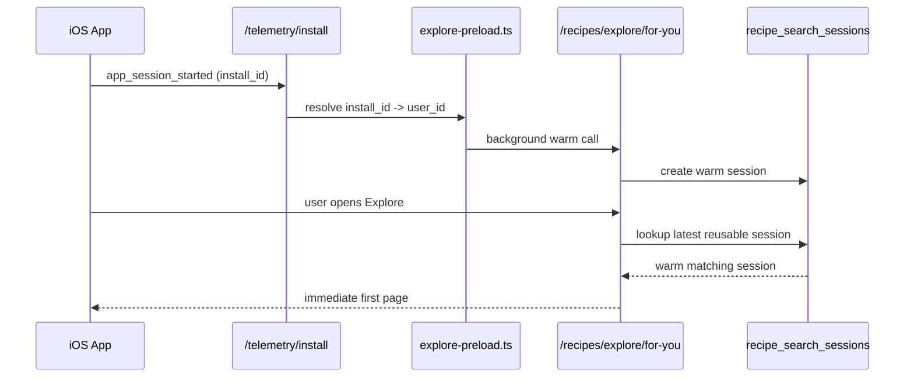

# Explore `For You` Serving, Preload, and Cache Guide

This document is the serving-side deep dive for Alchemy's `For You` feed.

Use this when you need to understand:

- why `For You` can now open warm instead of blocking on a cold request
- how server-side session reuse works
- how iOS preloading works
- how install telemetry warms the feed before Explore opens
- what the timeout guard still does
- how to debug regressions in production

Companion document:

- [Explore `For You` Guide](/Users/john/Projects/alchemy/docs/explore-for-you.md)

Primary implementation files:

- [for-you.ts](/Users/john/Projects/alchemy/supabase/functions/v1/search/for-you.ts)
- [session-store.ts](/Users/john/Projects/alchemy/supabase/functions/v1/search/session-store.ts)
- [explore-preload.ts](/Users/john/Projects/alchemy/supabase/functions/v1/lib/explore-preload.ts)
- [install-telemetry.ts](/Users/john/Projects/alchemy/supabase/functions/v1/routes/install-telemetry.ts)
- [APIClient.swift](/Users/john/Projects/alchemy/apps/ios/Alchemy/Core/Networking/APIClient.swift)
- [ContentView.swift](/Users/john/Projects/alchemy/apps/ios/Alchemy/App/ContentView.swift)
- [TabShell.swift](/Users/john/Projects/alchemy/apps/ios/Alchemy/Features/Shell/TabShell.swift)
- [ExploreView.swift](/Users/john/Projects/alchemy/apps/ios/Alchemy/Features/Explore/ExploreView.swift)

## Why This Exists

`For You` originally had a correctness-first serving path:

1. load profile inputs
2. build or reuse taste profile
3. retrieve candidates
4. rerank
5. return page 1

That worked functionally, but it made first paint too sensitive to model latency.

The current serving design changes the priority order:

1. serve warm if possible
2. build in background whenever possible
3. keep a hard safety fallback if a cold request still hits a slow model path

That means the primary serving strategy is now preload + session reuse, not synchronous rerank latency.

## Core Serving Modes

There are now four distinct ways a `For You` request can be served.

### 1. Warm Session Reuse

Best case.

The API finds a fresh matching `recipe_search_sessions` row and serves directly from it.

The current reuse key is effectively:

- `owner_user_id`
- `surface = explore`
- `applied_context = for_you | preset`
- `algorithm_version`
- `preset_id`
- `normalized_input`
- `expires_at > now()`

Implementation:

- [session-store.ts](/Users/john/Projects/alchemy/supabase/functions/v1/search/session-store.ts#L108)
- [for-you.ts](/Users/john/Projects/alchemy/supabase/functions/v1/search/for-you.ts#L1091)

This avoids:

- embedding work for the request
- candidate retrieval work for the request
- rerank work for the request
- a new session write

### 2. App-Preloaded Response

The iOS app keeps a lightweight in-memory `ExploreFeedPreloader`.

It preloads the default `For You` response while the app shell becomes active and while the user is still somewhere other than Explore.

Implementation:

- [APIClient.swift](/Users/john/Projects/alchemy/apps/ios/Alchemy/Core/Networking/APIClient.swift#L428)
- [TabShell.swift](/Users/john/Projects/alchemy/apps/ios/Alchemy/Features/Shell/TabShell.swift#L87)
- [ContentView.swift](/Users/john/Projects/alchemy/apps/ios/Alchemy/App/ContentView.swift#L56)

When Explore opens:

- if the preloader has a fresh cached response, Explore renders it immediately
- the preloader refreshes in the background
- if no cached response exists, Explore awaits the shared in-flight load instead of starting duplicate requests

Implementation:

- [ExploreView.swift](/Users/john/Projects/alchemy/apps/ios/Alchemy/Features/Explore/ExploreView.swift#L210)

### 3. Server Warmup From Install Telemetry

This is the path that improves the current production app even before a new app release.

The already-shipping app emits `app_session_started` via install telemetry.

The backend now:

1. receives `app_session_started`
2. looks up whether that `install_id` is already linked to a known `user_id`
3. schedules a background `For You` warmup for that user

Implementation:

- [install-telemetry.ts](/Users/john/Projects/alchemy/supabase/functions/v1/routes/install-telemetry.ts#L69)
- [explore-preload.ts](/Users/john/Projects/alchemy/supabase/functions/v1/lib/explore-preload.ts#L13)

That warmup builds the same feed through the real serving stack and populates a reusable `recipe_search_sessions` row before the user opens Explore.

### 4. Cold Request With Safety Guard

Worst case.

If no warm path exists, the request still executes the full personalized pipeline.

That path still has a rerank circuit breaker. This is no longer the serving strategy; it is only a guardrail so a stalled rank call does not trap the UI indefinitely.

Implementation:

- [for-you.ts](/Users/john/Projects/alchemy/supabase/functions/v1/search/for-you.ts#L966)

## End-to-End Sequence



## Exact Reuse Logic

The reuse check happens after the request has:

- loaded the active algorithm version
- collected recent user signals
- ensured a usable taste profile exists
- constructed the normalized retrieval text for the current preset context

Only then does it check for a reusable session.

Why the reuse key includes `normalized_input`:

- it captures the personalized retrieval text derived from the taste profile
- it changes when the effective request meaning changes
- it keeps the cache keyed to what the feed was actually asking retrieval for

Why the reuse key includes `algorithm_version`:

- serving versions must not leak across experiments or production rollouts
- old sessions should not be mistaken for new-model output

Why the reuse key includes `preset_id`:

- `For You`
- `Quick & Easy`
- `Healthy`
- any other Explore chip

all need separate reusable session lines because each narrows discovery differently.

## What The App Preloader Actually Does

The iOS preloader is deliberately small and dumb.

It does not rank.
It does not infer.
It does not decide what the feed should be.

It only:

- starts a shared request early
- stores the decoded `ForYouFeedResponse`
- returns a fresh cached response when available
- deduplicates in-flight loads so multiple UI callers do not spawn duplicate network work

This keeps intelligence on the server and makes the client cache an optimization layer, not a shadow recommender.

## What The Server Warmup Actually Does

The server warmup uses the real feed path, not a fake cheap variant.

It loads:

- preferences
- memory snapshot
- active memories
- safety exclusions

Then it calls the actual `getExploreForYouFeed` code path in the background.

Implementation:

- [explore-preload.ts](/Users/john/Projects/alchemy/supabase/functions/v1/lib/explore-preload.ts#L45)

That matters because:

- the warm path and the live request path stay behaviorally aligned
- there is no second hidden algorithm
- telemetry still represents the real system

## What The Timeout Guard Still Does

The rank timeout guard still exists.

It exists for one reason only:

- if the request falls through all warm paths and reaches rerank, a bad provider call still must not leave the user staring at a spinner forever

What it is not:

- it is not the personalization strategy
- it is not the cache strategy
- it is not the correctness mechanism

The serving order is now:

1. app-side preload cache
2. server-side reusable personalized session
3. server-side background warmup off install telemetry
4. cold request path
5. rerank circuit breaker only if the cold request still reaches rerank

## Freshness Model

Freshness is intentionally bounded rather than perfect.

Current freshness controls:

- session TTL: `30 minutes`
- app preloader freshness window: `10 minutes`
- algorithm version must match
- retrieval text must match

This means:

- a warm response can be reused for a short time
- the system does not assume feeds should live forever
- active behavior changes still eventually roll forward through normal request and warmup traffic

## Production Signals To Watch

Use these signals when judging whether serving is healthy.

### Primary

- `explore_feed_served.payload.feed_latency_ms`
- `explore_feed_served.payload.fallback_path`
- `explore_feed_served.payload.rerank_used`

### Supporting

- cache reuse rate inferred from low-latency serves with no cold-build behavior
- install-session warm coverage
- personalization board fallback rate
- personalization board median feed latency

## How To Debug A Regression

When `For You` feels slow again, inspect in this order.

### 1. Check health

```bash
curl https://api.cookwithalchemy.com/v1/healthz
```

### 2. Check recent feed-served telemetry

Look for:

- `feed_latency_ms`
- `fallback_path`
- `preset_id`
- `profile_state`

If latency is high and `fallback_path` is `rank_scope_timeout` or `rank_scope_failed`, the request is still hitting cold rerank too often.

### 3. Check whether warmup is firing

Inspect whether:

- `app_session_started` is arriving for the install
- that install is linked in `user_acquisition_profiles`
- the server is then producing a reusable `recipe_search_sessions` row

### 4. Check whether reuse is matching

If warmup is running but reuse is not hitting, compare:

- `algorithm_version`
- `preset_id`
- `normalized_input`
- session age / expiry

The common miss modes are:

- the warm session expired
- the preset changed
- the personalized retrieval text changed
- the app did not actually trigger session-start telemetry

## What Counts As Success

The serving path is working correctly when:

- app session start warms `For You` before the user reaches Explore
- Explore opens on a warm feed instead of a cold build
- first paint usually avoids synchronous rerank
- telemetry shows median feed latency trending down
- `fallback_path` becomes the exception instead of the normal path

## Current Tradeoffs

- session reuse is keyed off request meaning and version, not a full explicit cache table
- app preload is in-memory only, not disk-persisted
- the safety timeout still exists as a last-resort circuit breaker
- the warm path optimizes for first paint, not for permanent zero-latency serving

These are intentional. They keep the system explicit and observable without introducing a second hidden serving stack.

## Likely Next Improvements

- persist app-side preload cache across launches if first-paint latency still matters after warmup
- add direct admin metrics for warm-hit rate versus cold-build rate
- add richer cache invalidation signals if profile freshness needs to react faster to behavior changes
- eventually move more ranking work off the synchronous request path if the live rerank remains too expensive
